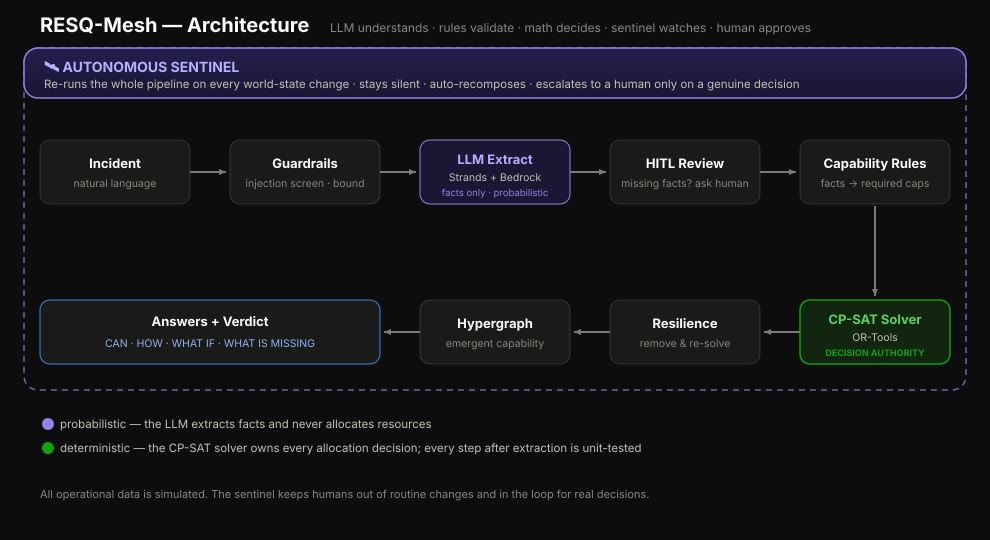

# MealMesh

> **When a volunteer cancels, this agent re-solves coverage in seconds — silently. No backup exists? It pages you instantly. The LLM interprets. The math decides. Humans only hear what matters.**

Built with [Strands Agents SDK](https://github.com/strands-agents/sdk-python) for the [Agents for Humans Hackathon](https://agents-for-humans.devpost.com/) — **Good Neighbor Agents** track.

---

## Inspiration

Last year, my neighbor Rosa spent every Thursday afternoon doing the same thing — calling, texting, begging. Not for donations. For *coverage.* She coordinates a weekly meal distribution at Riverside Community Center that feeds 200 families. And every single week, someone cancels. A driver's car breaks down. A packer has a sick kid. A site lead gets stuck at work.

Rosa told me she spends 5–10 hours a week just reshuffling schedules. Not cooking. Not fundraising. Not talking to the families she serves. Just logistics. Phone tag. "Can you cover for Maria?" texts sent to ten people, hoping two reply.

The worst part? 90% of the time, there's an obvious backup. She just can't *see* it fast enough. And while she's solving the easy ones, the real emergencies — the ones where there genuinely is no backup and a site might go dark — get buried in the noise.

This is exactly the kind of work an AI agent should do. Not a chatbot that suggests names. Not a dashboard Rosa has to check. An agent that runs silently in the background, absorbs the routine disruptions, and only taps Rosa on the shoulder when there's a genuine decision that needs a human brain and a human heart.

That's MealMesh.

## What It Does

MealMesh is an autonomous agent that keeps community meal programs running. It takes a natural-language request — *"We need Thursday coverage at Riverside: a van driver, a packer, and a site lead by 4 PM"* — and handles everything from understanding to decision-making to monitoring.

**The AI never makes the decision.** It only extracts facts. A mathematical constraint solver (CP-SAT) *proves* whether coverage is feasible and picks the optimal volunteer team. A resilience engine stress-tests the plan by simulating every possible single-volunteer cancellation — so Rosa knows what would break before it happens.

Then the **Silent Deputy** takes over. It's an autonomous sentinel that watches for real-world changes — cancellations, returns, new volunteers — and re-runs the full pipeline on every change. If it can absorb the disruption, it stays silent. If the plan actually breaks, it escalates immediately with full context.

The result: Rosa's phone stops buzzing with solvable problems. It only buzzes when it matters.

## How It Works

```
Natural language request
        │
        ▼
  ┌─────────────┐
  │  Guardrails  │  Sanitize input, flag injection attempts
  └──────┬──────┘
         ▼
  ┌─────────────┐
  │  LLM Extract │  Strands + Amazon Bedrock → structured Mission (facts only)
  └──────┬──────┘
         ▼
  ┌─────────────┐
  │  HITL Review │  Missing critical facts? → ask a human
  └──────┬──────┘
         ▼
  ┌─────────────┐
  │ Capabilities │  Deterministic rules: facts → required capabilities
  └──────┬──────┘
         ▼
  ┌─────────────┐
  │  CP-SAT      │  OR-Tools solver → optimal feasible coalition
  └──────┬──────┘
         ▼
  ┌─────────────┐
  │  Resilience   │  Remove each resource, re-solve → fragility map
  └──────┬──────┘
         ▼
  ┌─────────────┐
  │  Hypergraph   │  Emergent capabilities + structural metrics
  └──────┬──────┘
         ▼
  ┌─────────────┐
  │  Sentinel     │  Autonomous monitor → escalate or stay silent
  └─────────────┘
```

### The Trust Boundary

The LLM **never allocates resources**. It only translates natural language into structured facts. Every decision after that is deterministic and mathematically provable:

| Layer | Probabilistic? | Can allocate resources? |
|---|---|---|
| Guardrails | No | No |
| LLM extraction | **Yes** | **No** — facts only |
| HITL review | No | No — gates the flow |
| Capability rules | No | No — derives requirements |
| CP-SAT solver | No | **Yes** — the decision authority |
| Resilience engine | No | No — stress-tests the decision |
| Human approval | Human | Final approval before execution |

### The Sentinel (Silent Deputy)

The **Silent Deputy** (`app/sentinel.py`) is the core of the submission. It watches for world-state changes (volunteer cancels, returns, new recruit) and autonomously decides:

- **SILENT** — nothing meaningful changed
- **AUTO-RECOMPOSE** — absorbed the loss silently (feasible + resilient)
- **ESCALATE** — genuine decision needed (fragile / infeasible / needs review)
- **IMPROVED / RESOLVED** — human's action restored the mission

Escalations are **edge-triggered** — it alerts when things get *worse*, not on every tick. No spam.

## Architecture Diagram



## How We Built It

We built MealMesh in layers, each independently testable, each defending one idea: **the language model interprets, but never decides.**

### Strands Agents SDK — Three Patterns

**Pattern 1 — Structured Extraction Agent**

```python
from strands import Agent
from strands.models.bedrock import BedrockModel

agent = Agent(
    model=BedrockModel(model_id="us.amazon.nova-lite-v1:0", ...),
    system_prompt="Extract facts only. Never decide.",
    structured_output_model=Mission,   # Pydantic model → guaranteed schema
)

result = agent("We need Thursday coverage — van driver, packer, site lead")
mission = result.structured_output   # Mission(destination=..., requirements=[...])
```

`structured_output_model` guarantees the LLM returns a valid `Mission`. Missing facts are `null`, not hallucinated.

**Pattern 2 — Tool-Calling ReAct Agent (The Advisor)**

```python
advisor = Agent(
    model=BedrockModel(...),
    system_prompt="Never decide yourself. Call tools and report their output.",
    tools=[assess_incident, get_available_resources, get_resources_by_capability],
)

answer = advisor("Can Riverside Eastside open Thursday?")
# → Agent calls assess_incident → CP-SAT solver runs → plain-English verdict
```

The Advisor orchestrates and explains. The deterministic tools decide.

**Pattern 3 — @tool Decorator**

```python
from strands import tool

@tool
def assess_incident(destination: str, incident_type: str, ...) -> dict:
    """Decide whether a meal site can be covered, and by whom."""
    mission = Mission(...)
    result = run_pipeline(mission, resources=list_available_resources(), ...)
    return {"verdict": result.verdict, "feasible": ..., "missing": ...}
```

9 tools total — from coalition planning to counterfactual failure analysis to recovery proposals. Strands handles schema generation, argument parsing, and result routing.

### The Layers

| Layer | Module | What it does |
|---|---|---|
| Guardrails | `app/guardrails.py` | Input sanitization, prompt-injection detection |
| LLM Extraction | `app/mission_agent.py` | Strands agent → structured `Mission` via Bedrock |
| HITL Review | `app/mission.py` | Gates the flow on missing critical facts |
| Capability Rules | `app/capabilities.py` | Deterministic: incident facts → required capabilities |
| CP-SAT Solver | `app/solver.py` | OR-Tools constraint solver → optimal volunteer team |
| Resilience | `app/resilience.py` | Remove each volunteer, re-solve → fragility map |
| Hypergraph | `app/hypergraph.py` | HyperNetX emergent capabilities as hyperedges |
| Sentinel | `app/sentinel.py` | Autonomous background monitor with edge-triggered escalation |
| Advisor | `app/advisor.py` | Strands ReAct agent — plain English to deterministic answers |
| Dashboard | `app/api/server.py` | FastAPI web UI with scenario presets and Sentinel replay |

## Challenges We Ran Into

**The trust boundary was hard to get right.** Early on, the LLM "helpfully" suggested volunteer assignments in its extraction output. It took several iterations of system prompt engineering and Pydantic validation to enforce: extract facts, nothing more. Strands' `structured_output_model` was the breakthrough — it made the contract enforceable, not just aspirational.

**Edge-triggered escalation was trickier than it sounds.** The sentinel's first version spammed alerts on every tick because it compared absolute state instead of *transitions*. A plan that was already infeasible triggered a new escalation every 30 seconds. We implemented severity ranking and only alert on worsening transitions — which also meant tracking "resolved" and "improved" states.

**Keeping the demo honest without AWS credentials.** Not everyone running the demo will have Bedrock access. Every layer needed a deterministic fallback path — demo missions, offline tool execution, dry-run notifications — without compromising the architecture.

## Accomplishments That We're Proud Of

**The LLM never once allocated a resource.** Across 27 test modules, 7,200 lines of tests, and every demo scenario, the trust boundary held. The language model interprets. The math decides.

**The Silent Deputy actually works.** In our Thursday simulation, 6 world events happen. The sentinel handles 4 silently — auto-recomposing without bothering anyone. It escalates exactly twice: once when the only van-certified driver cancels, and once when two critical roles cancel simultaneously. Handle the routine, surface the real decisions.

**Independently testable end to end.** Run `pytest tests/ -v` with zero AWS credentials and every test passes. The deterministic pipeline doesn't need the cloud to prove it works.

**9,700 lines of production code, 7,200 lines of tests, 9 Strands tools, 27 test modules.** And it all composes through a single `run_pipeline()` call.

## What We Learned

**Agents are most powerful when most constrained.** Every time we pulled authority *away* from the LLM and gave it to deterministic code, the system got more reliable. The best pattern: LLM as an *interface* to deterministic *authority*.

**Strands' `@tool` decorator is the cleanest LLM-to-backend bridge we've used.** The function signature *is* the contract.

**Resilience testing should happen before deployment, not after failure.** Rosa doesn't just know the plan works. She knows exactly which single cancellation would break it.

**Community coordination is an underserved domain for AI.** The people who need autonomous help the most are doing unpaid coordination work with spreadsheets and group texts. They deserve better tools.

## What's Next for MealMesh

- **Real-world pilot** — early conversations with two community meal programs for live testing
- **Multi-site orchestration** — joint optimization across locations sharing volunteers
- **SMS / WhatsApp** — escalations where coordinators actually are (not just Slack)
- **AgentCore deployment** — always-on managed sentinel via Amazon Bedrock AgentCore
- **Open-source playbook** — fork, plug in your roster, connect Slack, running in an afternoon

## Quick Start

### Prerequisites

- Python 3.11+
- AWS credentials with Amazon Bedrock access (optional — falls back to demo data)

### Install & Run

```bash
git clone https://github.com/<your-username>/resq-mesh.git
cd resq-mesh
python -m venv .venv && source .venv/bin/activate
pip install -r requirements.txt

# CLI demo (no AWS needed)
python -m app.cli --demo

# Dashboard
uvicorn app.api.server:app --reload
# → http://localhost:8000
```

### With Amazon Bedrock (live NL extraction)

```bash
export AWS_DEFAULT_REGION=us-east-1
export AWS_ACCESS_KEY_ID=<your-key>
export AWS_SECRET_ACCESS_KEY=<your-secret>

python -m app.cli "We need Thursday coverage at Riverside — a van driver, a packer, and a site lead by 4pm"
```

### Run Tests

```bash
pytest tests/ -v
```

## Key Features

| Feature | Details |
|---|---|
| **Strands Agents SDK** | LLM extraction agent with tool use and structured output |
| **OR-Tools CP-SAT Solver** | Mathematically optimal resource allocation — not LLM guesswork |
| **Counterfactual Resilience** | "What if Volunteer X cancels?" answered for every person in the plan |
| **Hypergraph Modeling** | Emergent multi-resource capabilities as hyperedges (HyperNetX) |
| **Guardrails** | Prompt injection detection, input sanitization, bounded input size |
| **Autonomous Sentinel** | Background agent that monitors and self-heals coverage plans |
| **Notifications** | Slack / webhook escalation delivery (configurable, dry-run safe) |
| **FastAPI Dashboard** | Interactive web UI with scenario presets and Sentinel replay |
| **AgentCore Ready** | Deployment entrypoint for Amazon Bedrock AgentCore |
| **Observability** | Structured logging, trace IDs, agent-level event tracking |

## Project Structure

```
app/
├── mission_agent.py       # Strands agent: NL → structured Mission
├── guardrails.py          # Input sanitization & injection detection
├── mission.py             # Mission model + HITL review gate
├── capabilities.py        # Deterministic: facts → required capabilities
├── solver.py              # OR-Tools CP-SAT coalition optimizer
├── resilience.py          # Counterfactual failure simulation
├── hypergraph.py          # HyperNetX emergent capability graph
├── orchestration.py       # Single wiring point for the full pipeline
├── sentinel.py            # Autonomous background monitor agent
├── advisor.py             # Strands ReAct conversational agent
├── notifications.py       # Slack / webhook escalation delivery
├── semantic_tools.py      # 6 advanced Strands @tool wrappers
├── tools.py               # 3 core Strands @tool wrappers
├── api/server.py          # FastAPI dashboard backend
├── cli.py                 # Command-line interface
└── ...                    # ~9,700 lines across 38 modules
tests/                     # 27 test modules, ~7,200 lines
examples/                  # Golden scenarios and structured missions
deploy/
├── agentcore/             # Amazon Bedrock AgentCore entrypoint
└── dashboard/             # Hosting guide (Render / Fly.io / Docker)
docs/
├── architecture.svg       # Architecture diagram
├── architecture.md        # Detailed architecture documentation
├── journey.md             # Build journey narrative
└── slos.md                # Service-level objectives
```

## Built With

Strands Agents SDK · Amazon Bedrock · AWS · Python · Google OR-Tools · CP-SAT Solver · FastAPI · HyperNetX · Pydantic · Docker · Amazon Nova Lite · Uvicorn · pytest · NumPy · Pandas · NetworkX · Render · Fly.io · Amazon Bedrock AgentCore · Slack API

## Tech Stack

| Component | Technology |
|---|---|
| Agent framework | [Strands Agents SDK](https://github.com/strands-agents/sdk-python) |
| LLM | Amazon Bedrock (Nova Lite) |
| Constraint solver | Google OR-Tools CP-SAT |
| Hypergraph | HyperNetX |
| API | FastAPI + Uvicorn |
| Config | Pydantic Settings |
| Deployment | Docker, Render, Fly.io, AgentCore |
| Tests | pytest (27 modules, ~7,200 lines) |

## Deployment

**Render** (fastest free HTTPS):
```bash
# render.yaml is pre-configured — connect repo at dashboard.render.com/blueprints
```

**Docker**:
```bash
docker build -t mealmesh .
docker run --rm -p 8000:8000 mealmesh
```

**AgentCore**:
```bash
pip install -r deploy/agentcore/requirements-agentcore.txt
agentcore configure --entrypoint deploy/agentcore/agent_entrypoint.py
agentcore launch
```

## Build Journey

See [docs/journey.md](docs/journey.md) for the full narrative of how each layer was designed, tested, and composed.

## License

[MIT](LICENSE)
